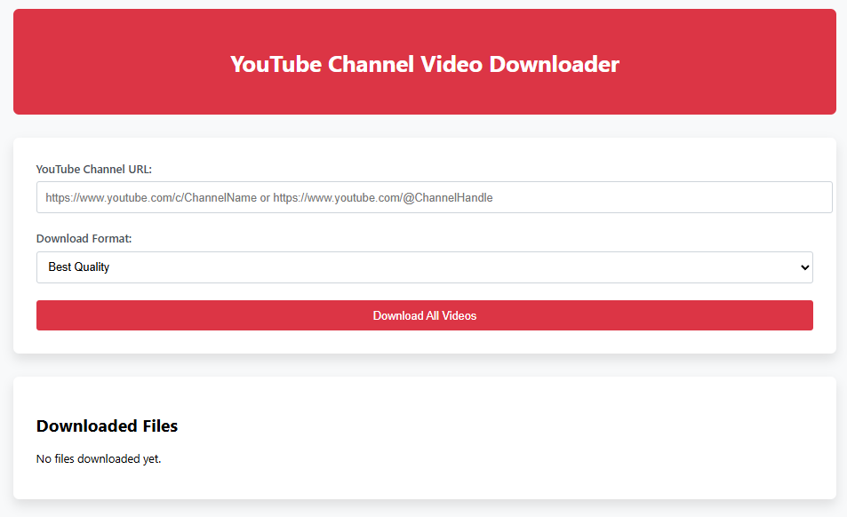

# YouTube Channel Video Downloader

A web application that downloads all videos from a YouTube channel with progress tracking and quality selection.

 

## Features

- Download entire YouTube channels
- Select video quality/format (MP4, WebM, audio-only)
- Real-time progress tracking
- Download speed and ETA display
- Responsive web interface
- Cross-platform compatibility

## Prerequisites

- Python 3.7+
- Node.js 14+
- FFmpeg (for format conversion)
- yt-dlp (installed automatically or manually with `pip install yt-dlp`)

## Installation

### Backend Setup

1. Navigate to the backend folder:
   ```bash
   cd backend
   ```
2. Install Python dependencies:
   ```bash
   pip install -r requirements.txt
   ```

### Frontend Setup

1. Navigate to the frontend folder:
   ```bash
   cd frontend
   ```
2. Install Node.js dependencies:
   ```bash
   npm install
   ```

## Running the Application

### Development Mode

Run both frontend and backend simultaneously:
```bash
cd frontend
npm run dev
```

This will start:
- Frontend on [http://localhost:3000](http://localhost:3000)
- Backend on [http://localhost:5000](http://localhost:5000)

### Production Build

1. Build the frontend:
   ```bash
   cd frontend
   npm run build
   ```
2. Start the backend server:
   ```bash
   cd ../backend
   python app.py
   ```

## Usage

1. Open [http://localhost:3000](http://localhost:3000) in your browser
2. Enter a YouTube channel URL (e.g., `https://www.youtube.com/@ChannelName`)
3. Select desired video quality
4. Click "Download Videos"
5. View progress and download files when complete

## Configuration

### Backend Settings
Edit `backend/app.py` to modify:
- Download folder location (`DOWNLOAD_FOLDER`)
- Allowed file extensions (`ALLOWED_EXTENSIONS`)
- Server port

### Frontend Settings
Edit `frontend/src/config.js` to change:
- API endpoint URLs
- Default quality settings
- UI preferences

## Troubleshooting

### Common Issues

#### Proxy or Connection Errors
- Ensure backend is running before frontend
- Check that ports 3000 and 5000 are not blocked

#### Video Download Failures
- Verify `yt-dlp` is updated: `yt-dlp -U`
- Check `ffmpeg` is installed: `ffmpeg -version`

#### Performance Issues
- Reduce concurrent downloads in `app.py`
- Select a lower video quality for faster downloads

## Technical Stack

### Backend
- Python 3
- Flask
- yt-dlp
- FFmpeg

### Frontend
- React 18
- Axios
- React Error Boundaries
- CSS Modules

## License

MIT License - See [LICENSE](LICENSE) for details.

## Support

For issues or feature requests, please open an issue at: ([https://github.com/rebreborn/yt-channel-downloader](https://github.com/RebReborn/yt-channel-downloader.git))

---

